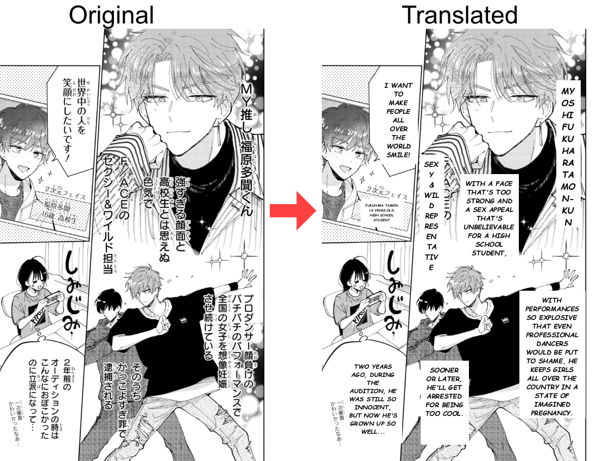
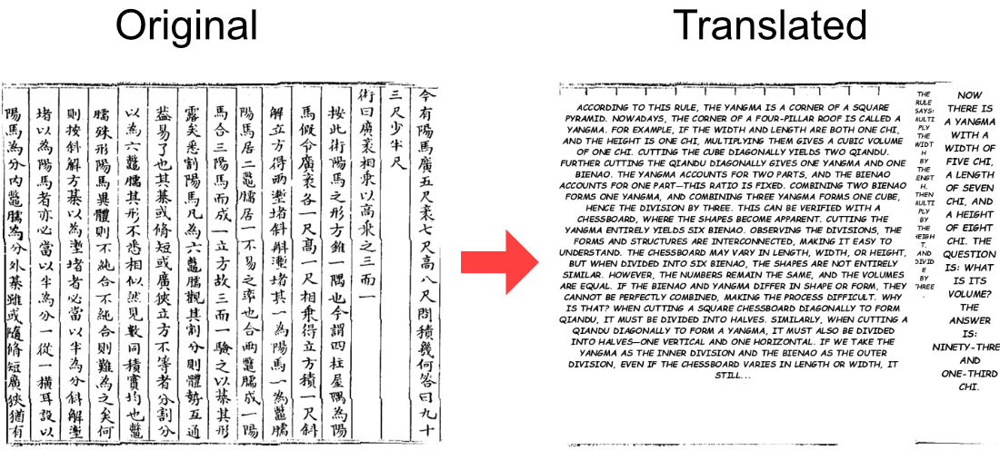

# OCR Translator

A pipeline for OCR-ing foreign (e.g. Japanese, Chinese) text from manga/comic pages or images, translating it to English via an AI LLM API, and overlaying the translated text back onto the images.

## Pipeline Overview

The project processes images in three sequential steps:

```
Input Images (PNG)  →  [1. OCR]  →  JSON Results  →  [2. Translate]  →  Translated JSON  →  [3. Draw]  →  Final Images
```

*Example 1: From Japanese to English*


> Disclaimer: This image shows the text after manual corrections. The OCR failed to detect 1 in 16 and only recognised 6, so I edited it.
> Source: [Hanayume](https://hanayume.com/series/c8751169f185f)

*Example 2: From Chinese to English*


> Source: [Internet Archive](https://archive.org/details/06057482.cn)

### Step 1: OCR — `run_ocr.py`
Uses **PaddleOCR** (`PaddleOCRVL`) to detect and extract text from PNG images. Results are saved as JSON files containing text blocks with bounding box coordinates. Already-processed images are skipped automatically.

### Step 2: Translate — `translate.py`
Sends extracted text to an LLM API (via OpenRouter) for English translation. Supports:
- **Conversation history** — maintains context across all text blocks and files in a single run for consistent translations
- **Dictionary lookup** — applies custom translations from `note.txt` (optional) before sending to the LLM
- **Retry logic** — retries up to 3 times if the translation does not begin with an ASCII character
- Change the model in `.env` to improve results
- Change the prompt in `.env` to translate a different source language
- Translated results are saved alongside the original JSON as `*_translated.json`

### Step 3: Draw — `draw.py`
Reads the translated JSON, draws white rectangles over the original text areas, and renders the English translation with:
- **Auto-fitting font size** — shrinks text to fit within the original bounding box
- **Word wrapping** — handles both normal and narrow (vertical text) layouts
- **Centred text** — horizontally centred within each block
- **Comic-style font** — uses [Comic Neue](https://fonts.google.com/specimen/Comic+Neue) (Bold Italic) by default; the `.ttf` must be placed in the project root (see [Font Configuration](#font-configuration))

## Prerequisites

- Python 3.8+
- An OpenRouter API key (or any OpenAI-compatible API endpoint)

## Installation

1. **Clone or download** this repository.

2. **Install dependencies** using `requirements.txt`:
   ```bash
   pip install -r requirements.txt
   ```
   > **Note:**
   > - `paddleocr` may require additional setup. See the [PaddleOCR documentation](https://www.paddleocr.ai/latest/en/index.html) for platform-specific instructions.
   > - The first time you run PaddleOCRVL, it will download models (~2 GB).

3. **Set up environment variables** — create a `.env` file in the project root:

   ```env
   API_KEY="your_openrouter_api_key"
   URL="https://openrouter.ai/api/v1/chat/completions"
   MODEL="deepseek/deepseek-v4-pro"
   TEMPERATURE=0.4
   PROMPT="You are a professional Japanese to English translator. Translate the following text into English. Only return the translation, no explanations. Keep translations consistent with prior context:"
   ```

   > **Note:** `PROMPT` must be a single line in the `.env` file.

4. **Place input images** in the `images/` folder (PNG format only).

## Usage

### Run the full pipeline
```bash
python main.py
```

This runs all three steps sequentially on the `images/` directory.

### Custom directories
```bash
python main.py -i "./my_images" -o "./my_output" -f "./my_final"
```

### Run individual steps

**OCR only:**
```bash
python -c "from run_ocr import run_all_ocr; run_all_ocr('images', 'output')"
```

**Translate only:**
```bash
python -c "from translate import run_all_translate; run_all_translate('output')"
```

**Draw only:**
```bash
python -c "from draw import run_all_draw; run_all_draw('output', 'images', 'final')"
```

## Configuration

### `.env` file

| Variable      | Description                                      |
|---------------|--------------------------------------------------|
| `API_KEY`     | Your API key (e.g., OpenRouter)                  |
| `URL`         | API endpoint URL                                 |
| `MODEL`       | Model name (e.g., `deepseek/deepseek-v4-pro`)    |
| `TEMPERATURE` | LLM temperature (0.0–2.0)                        |
| `PROMPT`      | System prompt for translation instructions       |

### Font Configuration

The project uses a pre-built merged font (`fonts/Merge/ComicNeueSymbols-BoldItalic.ttf`) that combines [Comic Neue Bold Italic](https://fonts.google.com/specimen/Comic+Neue) with [Noto Sans Symbols 2](https://fonts.google.com/noto/specimen/Noto+Sans+Symbols+2), so symbol characters like ♡ ★ ✿ render correctly without a separate fallback font. It is already included in the repo — no extra steps needed.

To use a different base font, edit the `COMIC` and `NOTO` variables at the top of `merge_fonts.py` to point to your chosen `.ttf` files, then re-run it to regenerate the merged font. Alternatively, edit `get_font()` in `draw.py` to point directly to any `.ttf` of your choice.

Both Comic Neue and Noto Sans Symbols 2 are licensed under the [Open Font License (OFL)](https://openfontlicense.org/). A copy of the license is included in each font's folder at `fonts/ComicNeue/` and `fonts/NotoSans/` respectively.

### Dictionary (`note.txt`)

This file is **optional**. If present, it defines custom translations for specific terms that are applied before the text is sent to the LLM, ensuring proper nouns and preferred terms are preserved. Format:

```
SourceWord=Translation
```

Example:
```
カカロット=Kakarot
悟空=Goku
ベジータ=Vegeta
ミスター・サタン=Hercule
```
The dictionary is applied before sending text to the LLM, ensuring proper nouns and preferred terms are preserved.

*Example*


## Utility Scripts

### `convert_to_png.py`
Converts images from various formats (JPG, BMP, TIFF, WebP, GIF) to PNG. Use this to prepare non-PNG images before running the pipeline.
```bash
python convert_to_png.py "input_folder" "output_folder"
```

### `checkfont.py`
Lists all available TrueType/OpenType fonts in the Windows Fonts directory. Useful for finding a font path to use in `draw.py`.
```bash
python checkfont.py
```
> Windows Fonts can also be check at [Microsoft Typography](https://docs.microsoft.com/en-us/typography/fonts/windows_10_font_list)

### `merge_fonts.py`
Merges Comic Neue Bold Italic with Noto Sans Symbols 2 to produce the bundled `ComicNeueSymbols-BoldItalic.ttf`. You only need to run this if you want to regenerate the font after changing the `COMIC` or `NOTO` paths at the top of the script.
```python
python merge_fonts.py
```

## Output Structure

```
images/              ← Input PNG images
├── ex1.png
├── pg1.png
└── pg2.png

output/              ← OCR & translation results
├── ex1_res.json                  ← Raw OCR output
├── ex1_res.json_translated.json  ← Translated JSON
├── pg1_res.json
├── pg1_res.json_translated.json
└── ...

final/               ← Final images with translated text overlaid
├── ex1_final.png
├── pg1_final.png
└── pg2_final.png
```

## Notes

- **Image format:** Only PNG images are processed. Use `convert_to_png.py` to convert other formats first.
- **Font:** The merged font is bundled at `fonts/Merge/ComicNeueSymbols-BoldItalic.ttf`. To use a different font, edit `get_font()` in `draw.py`.
- **OCR skipping:** If a JSON result already exists for an image, OCR is skipped for that file. Delete the JSON to re-run OCR on it.
- **Translation context:** Conversation history is shared across all files processed in a single run. Running files in a consistent order will produce more coherent translations.
- This project depends on [PaddleOCR](https://github.com/PaddlePaddle/PaddleOCR), licensed under the Apache License 2.0.